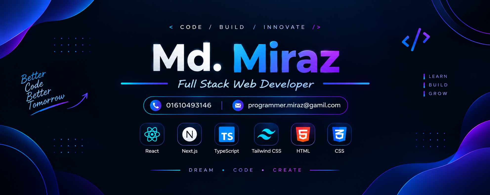

  

<h3> Hi 👋, I'm Md. Miraz </h3>

Full Stack  Developer 

<h2>👨‍💻 About Me</h2>

Hi! I'm Md. Miraz, a passionate Frontend Developer focused on building modern, responsive, and user-friendly web applications.

I mainly work with React.js, Next.js, TypeScript, JavaScript, Tailwind CSS, and basic backend technologies. I enjoy learning new technologies and turning ideas into clean and functional web applications.

<h3> 🚀 What I Do</h3>

* 💻 Build modern and responsive web applications
* ⚛️ Develop frontend applications with React.js, Next.js & TypeScript
* 🎨 Create clean and interactive UI with Tailwind CSS
* 🧩 Build reusable components and maintain clean project structure
* 🔄 Work with React Hooks, Context API & state management
* 🌐 Fetch and manage API data in React & Next.js
* 📚 Currently improving my React, Next.js & TypeScript skills
* 🚀 Continuously learning and building new projects

<h2>🛠️ Tech Stack</h2>
<h3 data-importer="text" align="left">Languages:</h3>

  
  
  

<h3 data-importer="text" align="left">Frontend:</h3>

  
  
  
  
  
  
  
  
  

<h3 data-importer="text" align="left">Database:</h3>

  

<h3 data-importer="text" align="left">Tools & Platforms:</h3>

  
  
  
  
  
  
  
  
  
  
  

<h2 data-importer="text" align="left">Github Statistics  & Analiysis</h2>
<picture data-importer="pacman">
  <source media="(prefers-color-scheme: dark)" srcset="https://raw.githubusercontent.com/miraz-vai-1/miraz-vai-1/pacman-output/pacman-contribution-graph-dark.svg?game=pacman">
  <source media="(prefers-color-scheme: light)" srcset="https://raw.githubusercontent.com/miraz-vai-1/miraz-vai-1/pacman-output/pacman-contribution-graph.svg?game=pacman">
  
</picture>

